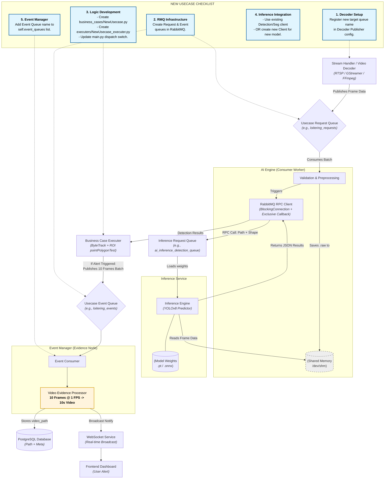

# LAWA AI Engine: Pipeline Architecture Documentation

## 1. Executive Summary
The LAWA AI Engine is a high-performance vision processing pipeline designed for real-time video analytics. It utilizes a decoupled, microservices-oriented architecture to ensure scalability, low latency (via Shared Memory), and modularity (via RabbitMQ RPC).

---

## 2. Pipeline Flow Diagram

## 2. Comprehensive Pipeline Flowchart

---

## 3. Detailed Component Interaction

### A. Stream Management
The **Stream Handler** (Video Decoder) serves as the source. It decodes RTSP streams and distributes frames into specific usecase queues. This allows multiple AI models to process the same stream independently without redundant decoding.

### B. The RPC & Shared Memory Technique
To avoid the overhead of sending large binary image data over RabbitMQ, the **AI Engine** employs a hybrid approach:
1. **Shared Memory**: The frame is written to `/dev/shm` (a RAM-based filesystem).
2. **RPC Payload**: Only the path to the frame and necessary metadata (shape, classes) are sent to the inference service.
3. **Synchronization**: The engine waits for the model's response using a unique `correlation_id` on a temporary callback queue.

### C. Business Case Logic
Once results (bounding boxes, track IDs, masks) are received, the **Executers** apply spatial and temporal rules. If an event is triggered, the engine gathers the required frames for evidence and publishes them to the Event Manager.

### D. Evidence Generation & Notification
When an event is confirmed, a batch of 10 frames is sent to the **Event Manager**. 
- **Evidence Video**: It generates a 10-second video at 1 FPS.
- **Database Persistence**: Camera details, event details, and the video path are stored in PostgreSQL.
- **WebSocket Broadcast**: A real-time notification is sent to the frontend for immediate alerting.

---

## 4. Extension Guidelines ("Box Beside the Box")

### Adding a New Usecase
> [!NOTE]
> **Checklist for adding a new usecase:**
> 1. **Queues**: Define `usecase_requests` and `usecase_events` in RabbitMQ.
> 2. **Logic**: Implement a new class in `Ai_engine/src/business_cases/`.
> 3. **Executer**: Create a wrapper in `Ai_engine/src/executers/`.
> 4. **Routing**: Add the usecase name to the `dispatch_vision_task` in `main.py`.
> 5. **EventManager**: Add the new event queue to the listener list in `EventManager/main.py`.

### Changing the Model Type
| Scenario | Action Required |
| :--- | :--- |
| **Same Model (e.g., YOLOv8)** | Change the `classes_id` or `confidence` parameters in the RPC request. |
| **Same Model Task** | Swap between `AiInferenceDetectionClient`, `AiInferenceSegmentationClient`, or `AiInferenceClassificationClient`. |
| **Custom Model (e.g., ONNX/TensorRT)** | 1. Deploy a new Inference Service container. 2. Define a new RabbitMQ queue for this service. 3. Add a matching Client class in `Ai_engine` to handle the new RPC routing. |
| **Trained Weights Update** | Update the model weights file path in the Inference Service's environment variables. |
